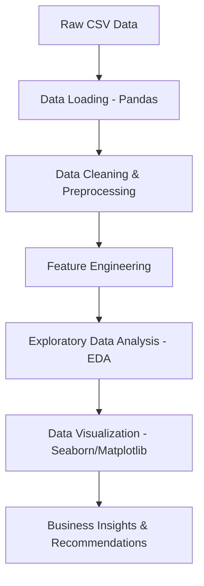

# Project Overview

**Simple Explanation:**
This project analyzes a large dataset of credit card customers (100,000 entries) to understand their financial behavior. It looks at how age, salary, and occupation affect a person's credit score, debt, and payment habits. The goal is to uncover patterns that can help banks or financial institutions offer better products and manage credit risk.

**Technical Explanation:**
This is an Exploratory Data Analysis (EDA) project built using Python, Pandas, Matplotlib, and Seaborn. The pipeline involves data loading, data cleaning (handling missing values, data type conversions, and outliers), feature engineering (creating an Income-to-Debt Ratio), and extensive data visualization. It extracts actionable business intelligence regarding customer demographics, financial health metrics, and creditworthiness.

---

# Elevator Pitch (30 Seconds)

"This project is a comprehensive Exploratory Data Analysis of a 100,000-record credit card dataset. I used Python, Pandas, and Seaborn to clean the data, handle missing values, and uncover financial patterns. The analysis revealed key correlations between customer demographics, like age and occupation, and their credit behavior, providing actionable insights for targeted financial products and risk management."

---

# System Architecture



**Component Relationships & Data Flow:**
1. **Raw CSV Data:** The starting point, containing 100,000 rows of customer data.
2. **Data Loading:** Pandas is used to ingest the raw data into a DataFrame.
3. **Data Cleaning & Preprocessing:** Handles missing values, removes negative ages, and converts string-formatted currency into numeric data.
4. **Feature Engineering:** Creates new features like `Income_to_Debt_Ratio` and `Age_Group` to facilitate deeper analysis.
5. **Exploratory Data Analysis:** Statistical summaries and correlation matrices are generated to understand relationships.
6. **Data Visualization:** Matplotlib and Seaborn translate statistical findings into visual plots (histograms, bar charts, heatmaps).
7. **Business Insights:** Final output translating visual trends into actionable financial recommendations.

---

# Folder Structure Deep Dive

```text
Credit_Analysis/
├── Credit_Card_Analysis.ipynb
├── README.md
└── docs/
    ├── PROJECT_WALKTHROUGH.md
    └── INTERVIEW_QNA.md
```

**Credit_Analysis/**
* **Purpose:** The root directory for the entire analysis project.
* **Why it exists:** To keep all code, documentation, and data references in one organized workspace.
* **What files inside do:**
  * `Credit_Card_Analysis.ipynb`: The core Jupyter Notebook containing all the Python code, data cleaning logic, visualizations, and insights.
  * `README.md`: A brief introduction to the project and the dataset used.
  * `docs/`: A dedicated folder for in-depth documentation and interview preparation materials.

---

# End-to-End Flow

**What happens when a user interacts with the application?**
*(Note: As an EDA notebook, the "user" is the Data Scientist running the cells)*

1. **Step 1: Data Ingestion:** The notebook reads `train.csv` into a Pandas DataFrame.
2. **Step 2: Initial Inspection:** Displays head, info, and statistical descriptions to understand data shape.
3. **Step 3: Data Cleaning:**
   - Converts invalid object columns into numeric values.
   - Handles negative and unrealistic ages (treating them as missing, then imputing with median).
   - Replaces missing names, occupations, and payment behaviors with 'Unknown' or mode values.
   - Fills missing continuous variables (like salary and debt) with median or mean values.
4. **Step 4: Feature Engineering:** Creates an `Income_to_Debt_Ratio` column to measure financial health.
5. **Step 5: Visual Analysis:** Generates plots to explore the distribution of Age, Income, and Credit Scores.
6. **Step 6: Bivariate Analysis:** Compares features (e.g., Annual Income vs. Payment Behavior, Credit Score vs. Outstanding Debt).
7. **Step 7: Conclusion:** Synthesizes the visual findings into actionable business recommendations.

---

# Feature Breakdown

### 1. Data Cleaning Pipeline
* **Business Purpose:** Ensures all business decisions are based on accurate and reliable data.
* **Technical Purpose:** Handles NaNs, removes outliers, and standardizes data types so mathematical functions and plotting libraries don't crash.
* **Files Used:** `Credit_Card_Analysis.ipynb`
* **Input:** Raw, messy DataFrame.
* **Output:** Cleaned DataFrame with no missing values.
* **Workflow:** Identify missing values -> Convert string currencies to numeric -> Impute missing numeric values using median/mean -> Impute categorical values.
* **Interview Explanation:** "How I would explain this feature to an interviewer: 'Raw data is never clean. I built a preprocessing pipeline that systematically identifies missing values and incorrect data types. For example, I found negative ages in the dataset and replaced them using median imputation to ensure our statistical distributions remained accurate.'"

### 2. Feature Engineering (Income-to-Debt Ratio)
* **Business Purpose:** Gives a single metric to evaluate how well a customer manages their debt relative to their income.
* **Technical Purpose:** Creates a new calculated column from two existing columns to provide better predictive power and correlation in the dataset.
* **Files Used:** `Credit_Card_Analysis.ipynb`
* **Input:** `Annual_Income` and `Outstanding_Debt` columns.
* **Output:** `Income_to_Debt_Ratio` column.
* **Workflow:** Divide annual income by outstanding debt (adding 1 to prevent division by zero errors).
* **Interview Explanation:** "How I would explain this feature to an interviewer: 'Sometimes existing data isn't enough. I engineered a new feature called the Income-to-Debt Ratio. This combined metric provided a much stronger indicator of a customer's financial health than looking at their income or debt in isolation.'"

### 3. Exploratory Data Analysis & Visualization
* **Business Purpose:** Translates rows of numbers into visual stories that stakeholders can easily understand.
* **Technical Purpose:** Uses Seaborn and Matplotlib to plot distributions, boxplots, and heatmaps to visually detect outliers and trends.
* **Files Used:** `Credit_Card_Analysis.ipynb`
* **Input:** Cleaned DataFrame.
* **Output:** Rendered charts and graphs.
* **Workflow:** Group data -> calculate aggregates (like mean salary per occupation) -> render plot -> document insight.
* **Interview Explanation:** "How I would explain this feature to an interviewer: 'I didn't just write code; I found the story in the data. I used Seaborn to create visualizations like heatmaps and pair plots, which allowed me to quickly identify that customers with Good credit scores have significantly lower outstanding debt and higher average incomes.'"

---

# Core Files Explained

### `Credit_Card_Analysis.ipynb`
* **Purpose:** The main executable file of the project. It holds the entire data science workflow.
* **Main Functions:** Pandas data manipulation (`read_csv`, `fillna`, `astype`), Seaborn plotting (`histplot`, `barplot`, `heatmap`).
* **Dependencies:** `pandas`, `numpy`, `matplotlib`, `seaborn`.
* **How it connects to other files:** It directly reads the external `train.csv` dataset and acts as the sole driver for the project.

---

# Database Layer

*Note: This project relies on a static CSV file rather than a traditional relational database. However, the schema of the CSV acts as our database layer.*

* **Schema:** A flat-file structure with 30 columns.
* **Models / Entities:** `Customer` (represented by a single row).
* **Key Columns (Attributes):**
  - Demographics: `Age`, `Occupation`, `Annual_Income`
  - Credit History: `Credit_Score`, `Num_Credit_Card`, `Num_of_Loan`
  - Financial Behavior: `Outstanding_Debt`, `Payment_Behaviour`, `Credit_Utilization_Ratio`

**Simple explanation:** Our database is a large spreadsheet where every row is a customer and every column is a piece of information about their finances.

---

# API Layer

*Note: This project is a Data Analysis notebook and does not expose a web API. There are no routes or endpoints.*

---

# AI / ML / LLM Components

*Note: The current phase of the project focuses strictly on Data Cleaning and Exploratory Data Analysis (EDA). There is no active Machine Learning or AI model deployed.*

**Interview Explanation:**
"This project focused on the foundational step of any data project: EDA and Data Cleaning. The data is now perfectly prepped to be fed into a Machine Learning model. The next logical step would be to train a Random Forest or XGBoost Classifier to predict a customer's `Credit_Score` based on their financial metrics."

---

# Design Decisions

**Why Python, Pandas, and Seaborn?**
* **Why chosen:** Python is the industry standard for data science. Pandas is incredibly efficient for tabular data manipulation, and Seaborn provides beautiful, high-level statistical graphics out-of-the-box.
* **Why not Excel/Tableau?** Excel struggles with 100,000 rows and complex programmatic transformations. While Tableau is great for dashboards, doing the cleaning and analysis in a Jupyter Notebook allows for a fully reproducible and version-controlled pipeline.
* **Pros:** Highly reproducible, easy to document thought processes alongside code, handles large data efficiently.
* **Cons:** Requires programming knowledge to view, unlike a shared interactive dashboard.
* **Trade-offs:** Sacrificed interactive dashboarding for programmatic flexibility and deep data cleaning capabilities.

---

# Challenges Faced

### 1. Messy Currency Strings
* **Problem:** `Annual_Income` and other currency fields were loaded as object (string) types because they contained special characters.
* **Root Cause:** Data was likely scraped or exported from a system that formats money with currency symbols and commas.
* **Solution:** Used Pandas string manipulation to strip non-numeric characters and convert the data into floats.
* **Learning:** Always check `df.info()` immediately after loading data. Just because a column looks like numbers doesn't mean Pandas recognizes it as numbers.

### 2. Invalid Data Entries (Negative Ages)
* **Problem:** Discovered ages that were negative or unrealistically high (e.g., -500).
* **Root Cause:** Data entry errors or system defaults in the raw dataset.
* **Solution:** Used `.loc` to identify ages < 0 or > 80, converted them to `NaN`, and then applied median imputation.
* **Learning:** Never trust the data source. Always perform basic bounds checking on continuous variables.

---

# Performance & Scalability

* **Current Limitations:** The entire dataset is loaded into RAM. At 100,000 rows, this is fine, but it would crash if the dataset grew to 50 million rows.
* **Future Improvements:** Transition from Pandas to PySpark or Dask for distributed data processing if the dataset scales up.
* **Scaling Strategy:** Move the CSV data into an SQL database (like PostgreSQL) or a data warehouse (like Snowflake), and execute queries directly against the database to aggregate data before pulling it into Python for visualization.

---

# Deployment

* **How project runs:** The project runs locally in a Jupyter Notebook environment.
* **Environment variables:** None currently required.
* **Build process:** Install dependencies via `pip install pandas numpy matplotlib seaborn`.
* **Deployment flow:** To "deploy" this project in a real-world scenario, the cleaning logic would be modularized into Python scripts (`.py`), scheduled using Airflow, and the visualizations would be migrated to a BI tool like Tableau or PowerBI.

---

# Learn This Project Like A Story

**The Entire Project as a Story:**

Imagine our **User (the Bank)** has a giant **Warehouse (the CSV Dataset)** filled with messy files on 100,000 customers.

The Bank hires me as the **Manager (the Data Scientist)** to make sense of it all. I walk into the warehouse and realize the files are a mess—some customers claim they are -500 years old, and the money amounts have weird symbols on them.

My first job is to hire a **Cleaning Crew (Pandas)**. The crew goes through every file, fixes the weird symbols, calculates the middle age (median) to replace the impossible ages, and ensures every file is perfectly readable.

Once the files are clean, I realize we need a better way to judge people. So, I invent a new rule called the **Income-to-Debt Ratio (Feature Engineering)**.

Finally, I want to present my findings to the Bank. I bring in an **Artist (Seaborn and Matplotlib)** to paint beautiful pictures (graphs) of the data. The Artist shows the Bank that people who work as Architects or Managers have the best financial habits, and that middle-aged people tend to earn the most but also manage their debt well.

Armed with these paintings, the Bank knows exactly who to offer premium credit cards to!
